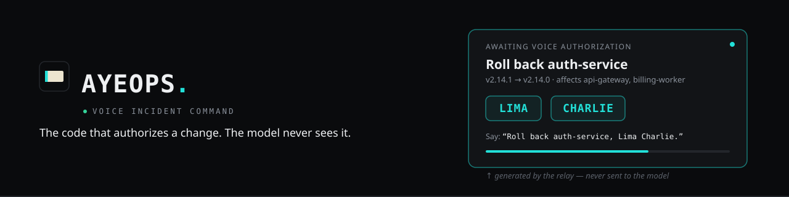
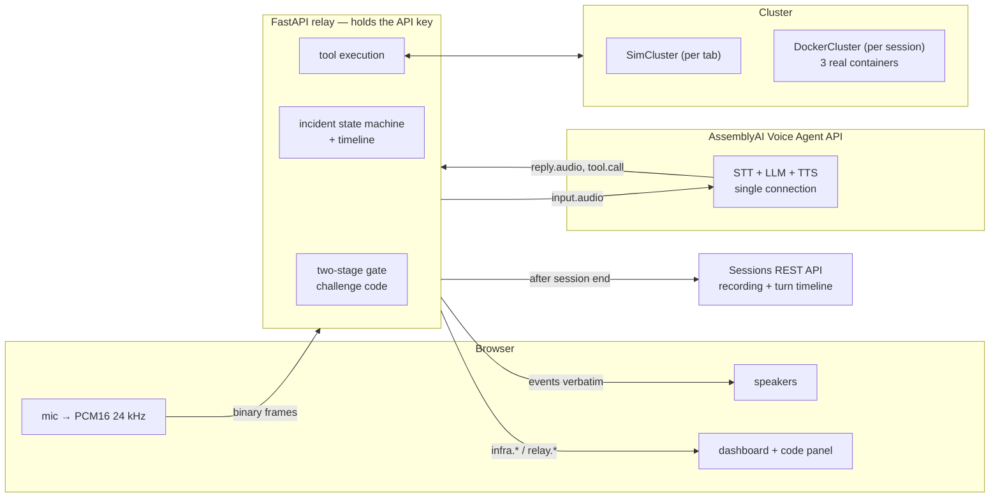

<div align="center">
  
</div>

<p align="center">
It pages you when production breaks, diagnoses the cause on its own, and then asks for something no
language model can fake: your voice, reading a one-time code it has never seen.
</p>

<p align="center">
<sub>
<strong>Blind</strong> — the approval code never enters the model's context &nbsp;·&nbsp;
<strong>Voiced</strong> — a human reads the change back to prove they understood it &nbsp;·&nbsp;
<strong>Refuses</strong> — declines a fix it already knows won't hold, and says why &nbsp;·&nbsp;
<strong>Logged</strong> — every authorization ships with a recording and a timeline
</sub>
</p>

<p align="center">
Built on the <a href="https://www.assemblyai.com/docs/voice-agents/voice-agent-api">AssemblyAI Voice Agent API</a>.
</p>

---

## The problem is not speed

The obvious pitch for an AI incident responder is *"mean time to resolution drops from [the 101-minute
industry median](https://stackgen.com/blog/10-sre-best-practices-for-reducing-mttr-in-2026) to 40 seconds."*
That pitch is real, for this incident's shape — and it is the least interesting thing here.

The actual problem with 3am incident response is that the on-call engineer is **impaired, alone, and
unaccountable**:

- **Impaired.** A large share of severe outages are prolonged by the *remediation*, not the fault. The
  tired human applies the wrong fix and extends the outage.
- **Alone.** There is no second pair of eyes at 3am. Change-approval process is precisely what gets
  bypassed during a Sev-1.
- **Unaccountable.** The record gets written hours later, from memory, by the person with the strongest
  incentive to be generous to themselves.

This is why AI ops tools stall in procurement. They don't stall because they're slow. They stall because
**nobody can prove who authorized what.** An LLM that can restart production is an audit finding.

AyeOps is built as the answer to that: not a faster hand, but a **sober second party** that does
the thinking you can't do at 3am, makes fat-fingering production structurally impossible, and produces the
record nobody would otherwise write.

---

## What happens in a run

1. Three services run healthy. The agent is watching, silent.
2. A bad deploy ships — `auth-service v2.14.1`, whose JWKS parser can't read the rotated signing key. It
   crash-loops for real. `api-gateway` starts returning real 502s. `billing-worker`'s queue backs up.
3. **The agent speaks first.** It pages you — it does not wait to be asked — and immediately begins
   read-only triage on its own authority.
4. It diagnoses the root cause from a single enriched health call and proposes exactly one fix.
5. **Your screen shows a two-word code — `LIMA CHARLIE`.** The model cannot see it.
6. You read it aloud. The *relay*, not the model, verifies it and executes precisely the authorized change.
7. The agent narrates the rollout. Everything goes green.
8. A postmortem is filed containing the verbatim authorization, and AssemblyAI's two-channel recording and
   turn timeline are downloaded next to it as evidence.
9. Ask *"What happened?"* and it answers from the verified record — not from its own recollection.

Mid-incident, the demo can **cut the AssemblyAI connection on purpose**. The relay is back in under two
seconds with full context, and the pending authorization still works.

---

## The core idea: the model never holds the trigger

Every consent mechanism that keys on the *words* the operator says is broken, and we broke ours three
times before arriving here:

| Version | Mechanism | How it failed |
|---|---|---|
| v1 | Keyword `"yes"` + word count | The agent says "yes" in ordinary replies. Its own voice, echoing through the mic, can approve a production change. |
| v2 | v1 + "the operator started speaking after the agent stopped" | A pile of heuristics defending a design that was wrong underneath. |
| **v3** | **A one-time code shown only on the operator's screen** | — |

In v3 the relay generates a two-word NATO code, sends it to the operator's display, and **never puts it in
the model's context.** The model literally cannot know it.

This isn't a mitigation, it's a structural impossibility:

- The model **cannot hallucinate approval** — it doesn't know the code.
- The agent's **own voice cannot approve** via echo — same reason.
- The **relay executes**, so even a fully compromised model is outside the trigger path.
- The tool is named `propose_remediation`, not `execute_*`. That rename fixed a real bug: models trained
  to be careful *refuse to call an `execute` tool* before hearing a human say yes, which made them
  describe the fix and stall instead of entering the consent flow. The fix was renaming the tool to what
  it actually does — not more prompt pleading.

Adopting v3 let us **delete** all three earlier heuristics. The code words are registered as `keyterms`,
so they transcribe reliably.

---

## Architecture



**The browser can only do two things:** stream raw PCM, and send two demo controls. It cannot send
`session.update`, cannot forge a `tool.result`, and cannot forge an authorization. The API key never
leaves the relay process.

---

## How it uses the Voice Agent API

Nine distinct surfaces, each for a measured reason:

| Surface | Why |
|---|---|
| Single-connection STT + LLM + TTS | No telephony, no Twilio. Browser Web Audio PCM16 24 kHz mono straight over WebSockets. |
| **Hold-mode tools**, everywhere | Interactive filler delays results. AssemblyAI's own timeline clocked a **93 ms tool at 5.9 s**. |
| `reply.create` | The agent pages you, narrates the rollout, and reports outcomes — proactively, not in response to a prompt. |
| **Phase-scoped `session.update`** | `propose_remediation` only exists in the model's schema while an incident is open — added on triage, removed on resolution. Least privilege enforced by the platform, not the prompt; verified live in the server's own `config_changes`. |
| **Mid-session prompt swap** | On resolution, the verified timeline is loaded into the prompt, so *"What happened?"* is answered from the record, not from memory. |
| Sessions REST API | The two-channel recording (operator left, agent right) and per-turn timeline are pulled down as an audit bundle. |
| `keyterms` | Service names and every code word, so authorization codes transcribe reliably. |
| `transcription_prompt` | Free-text bias toward this call's real vocabulary — NATO code words, "crash loop", "JWKS" — separate from and additional to keyterms. |
| `voice_focus: "near-field"` | Cuts background bleed on the browser mic without a separate noise-suppression pipeline. |

### Three places the live server disagrees with the docs

Each found by instrumenting, not guessing — and each confirmed against **AssemblyAI's own session
timeline**, which makes them independently verifiable:

1. **`input.speech.stopped` arrives *with* the reply**, not when speech ends — so it's useless for latency.
   We measure from the operator's last voiced mic frame instead. Reported latency is honest:
   **0.84–1.09 s** from end of speech to first agent audio.
2. **Hold-mode tool calls stay open after a barge-in.** The docs say drop results on `interrupted`; doing
   so froze the agent for a full 60 s, with `timed_out=True` in the server's own timeline. Results are now
   always delivered once no reply is in progress.
3. **`session.resume` never succeeded** — 11 variants tried, all refused. `session.ready` carries an
   undocumented signed `resume_token` that the resume endpoint won't accept. So the relay stopped
   depending on it: incident state lives here, and a refused resume reconnects instantly as a **new
   session with no greeting and a prompt rebuilt from our own timeline.** Recovery measured at **1.8 s**.

---

## Measured

On real Docker containers, against the real API, including a deliberate mid-incident link cut:

| Metric | Result |
|---|---|
| Bad deploy → all green | **29 s** |
| Turn latency | **0.84–1.09 s** |
| Recovery from connection loss | **1.8 s**, context intact |
| Cluster boot → healthy | 5.0 s |
| Injected fault → visible | 2.6 s |
| Rollback → all green | 4.1 s |

*Time to recover runs from incident **detection** to all-green. Latency is measured from the operator's
last voiced mic frame — the honest method, not the flattering one.*

---

## Competitors

| Category | Representative | What they do well | What's missing |
|---|---|---|---|
| **Incident management platforms** | PagerDuty SRE Agent (Aug 2026), incident.io, Rootly | Alerting, on-call rotation, AI-drafted fixes as a PR | Approval is a **GitHub click**. Nothing proves a present human read it, understood it, or is even the person on call. |
| **AI SRE agents** | Cleric, Resolve.ai, k8sgpt, Dynatrace Autonomous Operations (Jul 2026) | Autonomous investigation and root-cause analysis | Largely **read-only or advisory** — precisely because the authorization problem is unsolved. The hard part isn't diagnosis, it's permission. |
| **ChatOps** | Slack bots, Backstage actions | Execute real operations from chat | Identity = an API token. No liveness, no anti-impersonation, no proof a *human* acted. |
| **Voice agent demos** | The typical hackathon entry | Natural conversation | Nothing irreversible ever happens, so no authorization model is needed — or built. |

**Where AyeOps sits:** every one of these gates a change with a click, a token, or nothing at all. None of
them prove a *present* human understood *this specific* change — they prove a channel was live, which is a
different and weaker claim. AyeOps is a working implementation of the pattern the IETF's WIMSE working group,
OpenID's CIBA, and MCP's elicitation mode are all independently converging on right now — out-of-band
authorization the agent can't forge from inside its own context — built specifically for voice, with one
addition none of those protocols require: the operator has to say back what they're approving, not just
approve it.

Everyone else is racing to make the agent **faster**. The bottleneck in production isn't speed — it's that
no one will grant an LLM write access to infrastructure. AyeOps is built around that constraint
instead of against it: reads are autonomous, writes require a live human voice reading a secret the model
cannot access, and every change leaves a postmortem record with the verbatim authorization and audio attached.

---

## Run it

```bash
cd backend

# relay (browser connects to ws://127.0.0.1:8000/ws with Origin http://localhost:3000)
uv run --env-file .env relay.py                  # in-memory cluster, one per tab
INFRA=docker uv run --env-file .env relay.py     # real containers, one project per session

# offline self-check — prints "ok"
uv run test_relay.py

# full live rehearsal (~90 s, uses API credit; synthesizes the operator's voice with gTTS)
INFRA=docker uv run --env-file .env --with gtts python live_e2e.py
```

Requires `ASSEMBLYAI_API_KEY` in `backend/.env`. `INFRA=docker` needs Docker and the `python:3.13-slim`
image pulled — **pre-pull it**, because a missing base image looks exactly like a broken cluster.

**Environment:** `INFRA` (sim|docker), `ALLOWED_ORIGINS`, `MAX_SESSION_S`, `MAX_DOCKER_CLUSTERS`,
`INCIDENT_DIR`, `AAI_URL`.

---

## The demo cluster is real

`INFRA=docker` gives every session **its own Docker Compose project** — own network, own ephemeral
localhost ports, torn down on session end, with stale projects swept at startup. Concurrent viewers never
collide.

The services are stdlib Python on the stock `python:3.13-slim` image, so there's no build step.
`auth-service v2.14.1` genuinely exits on a JWKS parse failure and genuinely crash-loops; the gateway
returns genuine 502s; the rollback genuinely recreates containers. Nothing about the failure is mocked.

The relay acts as the CD system — it tracks deploy history, so it knows what "the previous version" means.

---

## Security posture

- The API key lives only in the relay. The browser cannot send config, tool results, or authorizations.
- **Origin allowlist**, so another site can't spend our key through a visitor's browser.
- Authorization codes are **one-time**, bound to an exact service and action, expire in 120 s, are never
  sent to the model, and are vetoable by "no / cancel / stop / wait".
- Model-supplied arguments are validated as untrusted input — service and action allowlists, bounded
  ranges.
- Session and cluster caps bound spend. Pre-signed evidence URLs are fetched without our key.

---

## Status

**Backend and dashboard: complete and live-verified.** Offline self-check plus a full live rehearsal
driver that synthesizes the operator's voice, so the whole demo is reproducible without a human in the
room. Built and tested, not just planned:

- **The Next.js/Tailwind dashboard** — the full event protocol is specified in
  [`session-handoff.md`](session-handoff.md) §11
- **Phase-scoped tools** — least privilege enforced by the platform: `propose_remediation` doesn't exist
  in the model's schema outside an open incident window, added and removed with `session.update`
- **The refusal** — the relay declines a remediation it already knows will fail (a restart on a service
  crash-looping from a bad deploy) and points the model at the fix that will, with the evidence attached
- **Blast radius stated aloud** before the authorization code arms, when the change affects anything else

**Roadmap — not yet built:**

- A deployed HTTPS URL (see `SPEC.md` F6)
- The repo goes public at submission (CI already runs on every push; no badge row here on purpose — nothing
  to show yet is more honest than a row of placeholders)
