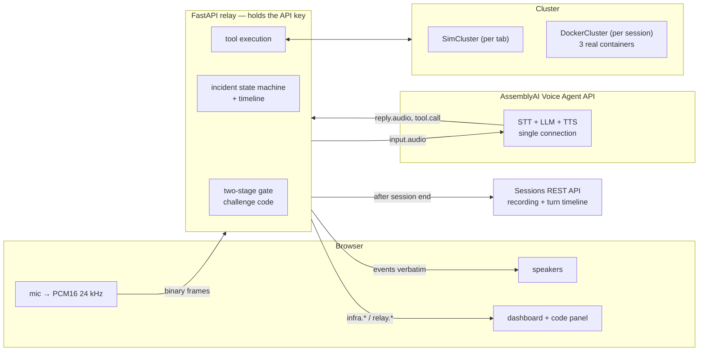

# Engineering deep-dive

The main [README](../README.md) is the pitch. This covers how it's actually built: the design history, the
architecture, every AssemblyAI Voice Agent API surface in use, and what real infrastructure the demo runs
against.

---

## The core idea: the model never holds the trigger

Every consent mechanism that keys on the *words* the operator says is broken. Two earlier designs proved it
before the current one:

| Version | Mechanism | How it failed |
|---|---|---|
| v1 | Keyword `"yes"` + word count | The agent says "yes" in ordinary replies. Its own voice, echoing through the mic, can approve a production change. |
| v2 | v1 + "the operator started speaking after the agent stopped" | A pile of heuristics defending a design that was wrong underneath. |
| **v3** | **A one-time code shown only on the operator's screen** | — |

In v3 the relay generates a two-word NATO code, sends it to the operator's display, and **never puts it in
the model's context.** The model literally cannot know it.

This isn't a mitigation, it's a structural impossibility:

- The model **cannot hallucinate approval** — it doesn't know the code.
- The agent's **own voice cannot approve** via echo — same reason.
- The **relay executes**, so even a fully compromised model is outside the trigger path.
- The tool is named `propose_remediation`, not `execute_*`. That rename fixed a real bug: models trained
  to be careful *refuse to call an `execute` tool* before hearing a human say yes, which made them
  describe the fix and stall instead of entering the consent flow. The fix was renaming the tool to what
  it actually does — not more prompt pleading.

v3 deleted the need for both earlier heuristics entirely. The code words are registered as `keyterms`, so
they transcribe reliably.

---

## Architecture

**The browser can only do two things:** stream raw PCM, and send two demo controls. It cannot send
`session.update`, cannot forge a `tool.result`, and cannot forge an authorization. The API key never
leaves the relay process.

---

## How it uses the Voice Agent API

Nine distinct surfaces, each for a measured reason:

| Surface | Why |
|---|---|
| Single-connection STT + LLM + TTS | No telephony, no Twilio. Browser Web Audio PCM16 24 kHz mono straight over WebSockets. |
| **Hold-mode tools**, everywhere | Interactive filler delays results. AssemblyAI's own timeline clocked a **93 ms tool at 5.9 s**. |
| `reply.create` | The agent pages you, narrates the rollout, and reports outcomes — proactively, not in response to a prompt. |
| **Phase-scoped `session.update`** | `propose_remediation` only exists in the model's schema while an incident is open — added on triage, removed on resolution. Least privilege enforced by the platform, not the prompt; verified live in the server's own `config_changes`. |
| **Mid-session prompt swap** | On resolution, the verified timeline is loaded into the prompt, so *"What happened?"* is answered from the record, not from memory. |
| Sessions REST API | The two-channel recording (operator left, agent right) and per-turn timeline are pulled down as an audit bundle. |
| `keyterms` | Service names and every code word, so authorization codes transcribe reliably. |
| `transcription_prompt` | Free-text bias toward this call's real vocabulary — NATO code words, "crash loop", "JWKS" — separate from and additional to keyterms. |
| `voice_focus: "near-field"` | Cuts background bleed on the browser mic without a separate noise-suppression pipeline. |

### Three places the live server disagrees with the docs

Each found by instrumenting, not guessing — and each confirmed against **AssemblyAI's own session
timeline**, which makes them independently verifiable:

1. **`input.speech.stopped` arrives *with* the reply**, not when speech ends — so it's useless for latency.
   Latency is measured from the operator's last voiced mic frame instead. Reported latency is honest:
   **0.84–1.09 s** from end of speech to first agent audio.
2. **Hold-mode tool calls stay open after a barge-in.** The docs say drop results on `interrupted`; doing
   so froze the agent for a full 60 s, with `timed_out=True` in the server's own timeline. Results are now
   always delivered once no reply is in progress.
3. **`session.resume` never succeeded** — 11 variants tried, all refused. `session.ready` carries an
   undocumented signed `resume_token` that the resume endpoint won't accept. The relay doesn't depend on it:
   incident state lives in the relay itself, so a refused resume reconnects instantly as a **new session
   with no greeting and a prompt rebuilt from the relay's own timeline.** Recovery measured at **1.8 s**.

---

## The demo cluster is real

`INFRA=docker` gives every session **its own Docker Compose project** — own network, own ephemeral
localhost ports, torn down on session end, with stale projects swept at startup. Concurrent viewers never
collide.

The services are stdlib Python on the stock `python:3.13-slim` image, so there's no build step.
`auth-service v2.14.1` genuinely exits on a JWKS parse failure and genuinely crash-loops; the gateway
returns genuine 502s; the rollback genuinely recreates containers. Nothing about the failure is mocked.

The relay acts as the CD system — it tracks deploy history, so it knows what "the previous version" means.
